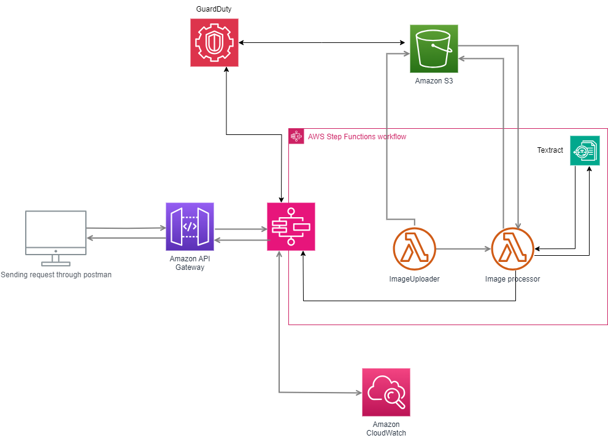

## Img2Txt Utility

AWS Cloud formation template for Image to text converter API, all services are part of AWS ecosystem and has been tested on a learner labs account. 
Make sure you have a valid AWS account or learner lab account.

### Overview of the Application on AWS:



The application has been successfully deployed on Amazon Web Services (AWS) using a serverless architecture, leveraging key AWS services such as AWS Lambda, Amazon S3, AWS Step Functions, Amazon API Gateway, Amazon Textract, and AWS GuardDuty.
The solution allows for the automated uploading of images to an S3 bucket, followed by image processing with AWS Textract to extract text from the images. This process is orchestrated through AWS Step Functions and triggered via an API endpoint exposed through Amazon API Gateway.

### Architecture Flow:

*   **API Gateway:** The image processing workflow is initiated by an HTTP request to API Gateway, which acts as the entry point for the application.
* 	**Step Functions:** The request from API Gateway triggers a Step Functions state machine, which coordinates the execution of two Lambda functions.
* 	**Lambda Functions:** The first Lambda function handles the image upload to S3, while the second function processes the image using Amazon Textract to extract text.
* 	**S3:** The uploaded image is stored in an S3 bucket, which serves as the source for Textract.
* 	**Textract:** The second Lambda function uses Amazon Textract to analyze the image and extract text.
* 	**GuardDuty:** AWS GuardDuty is enabled to monitor the environment for any suspicious activity and ensure the application's security.

### Format to invoke api post method: 

```javascript
{
  "input":"{\"image\": \"<base64-of-img>\"}",
  "stateMachineArn": "<ARN statemachine>"
}
```


